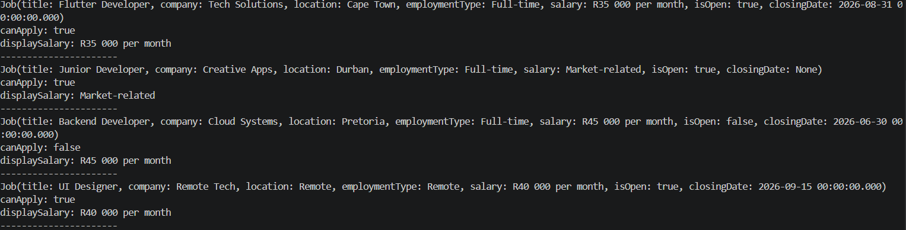
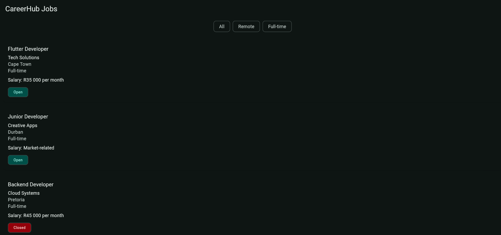
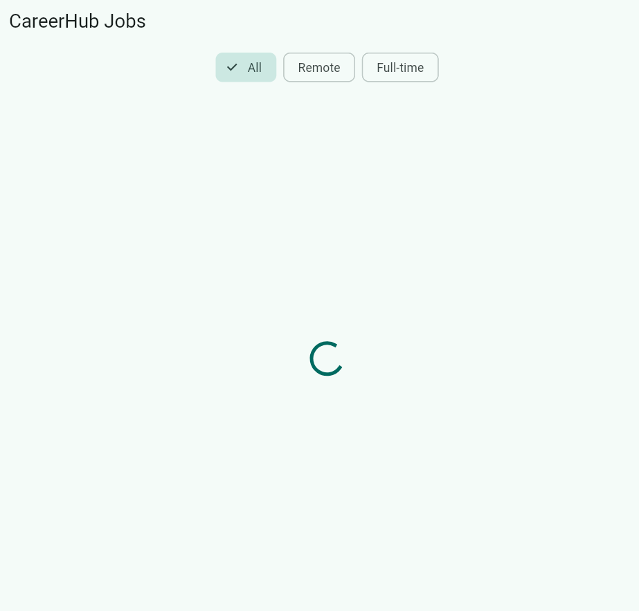
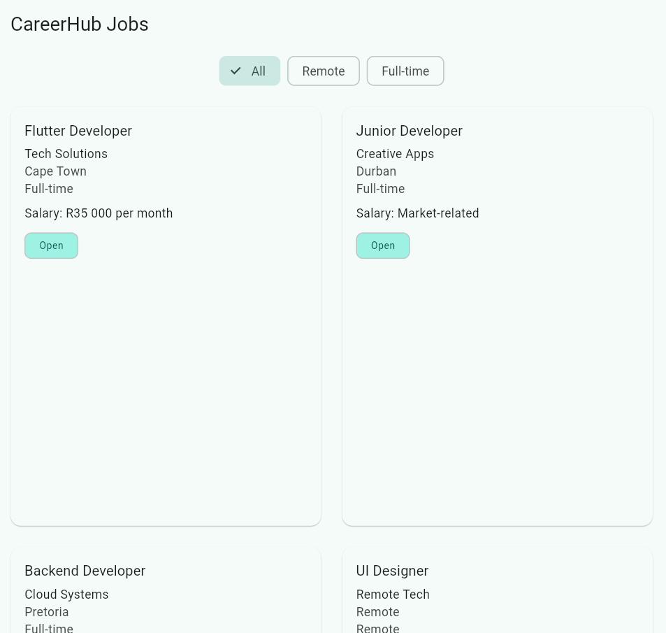
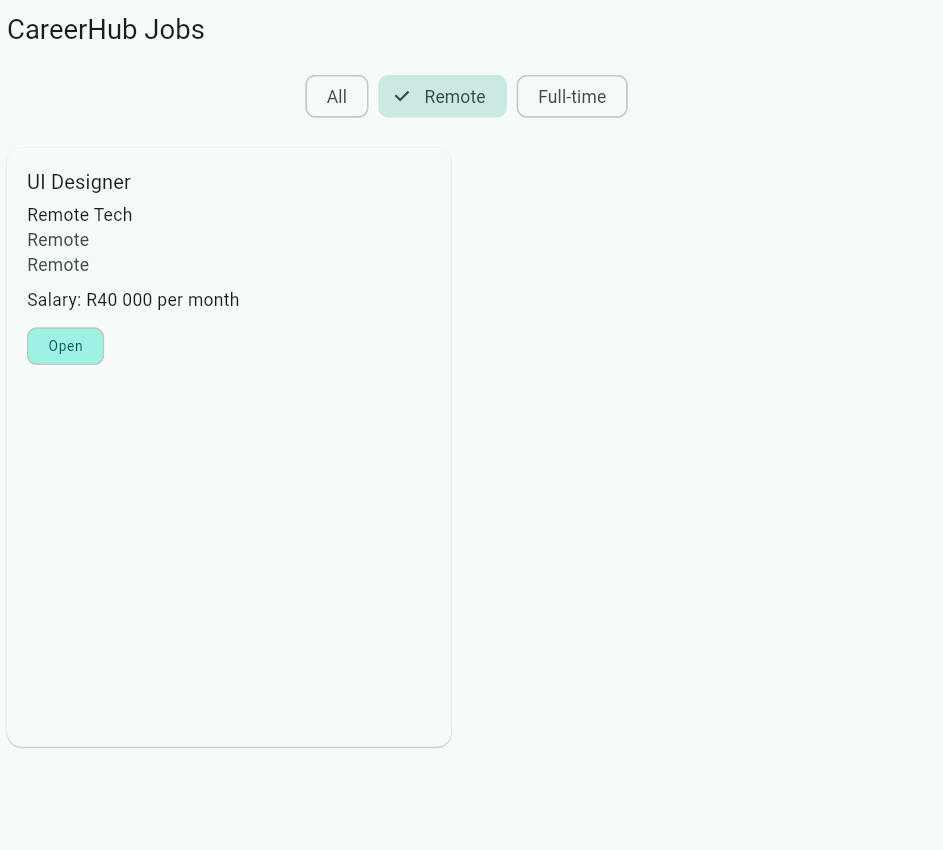
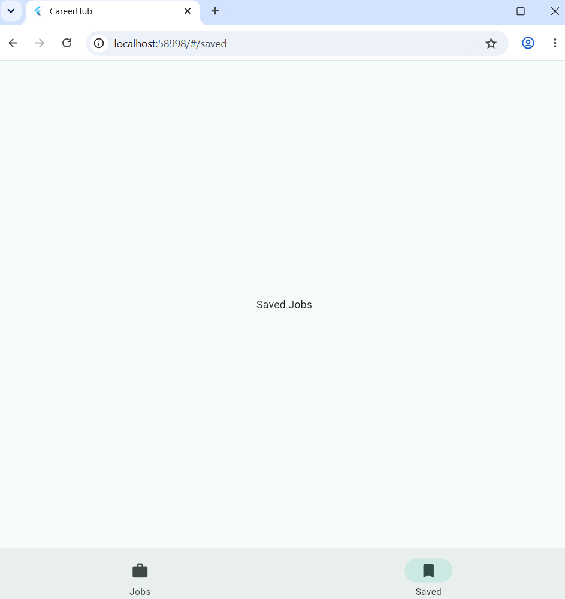
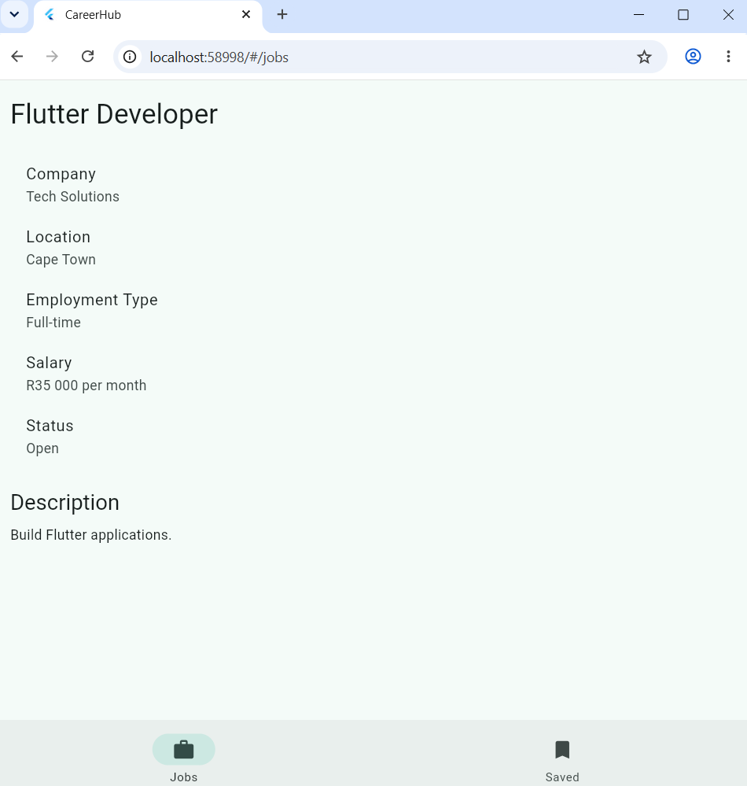

# Careerhub

## Question 1
| Field | My decision | Domain justification |
| --- | --- | --- |
| title | Non-nullable | Every job listing must have a title so applicants know what role they'll be applying for. |
| company | Non-nullable | Every job listing must know which company or recruiting agency is is advertising the job. |
| location | Non-nullable | Applicants need to know where the job is based in order to determine whether it is suitable for them. |
| salary | Nullable | An employer may choose not to disclose the salary in the job advertisement. |
| closingDate | Nullable | Some vacancies remain open until filled or are published before a closing date has been decided. |
| description | Non-nullable | A job listing should include a description so applicants understand the duties and requirements of the role. |
| employmentType | Non-nullable | Applicants need to know whether the position is full-time, part-time, contract, or remote before applying. |
| isOpen | Non-nullable | Every job listing must have a clear status indicating whether applications are currently being accepted. |

The closingDate field is the most dangerous nullable field to render without an explicit null check because, if it is missing and the application assumes it always has a value, users could see an incorrect date, a system error, or even a blank page instead of the job details. This could mislead applicants into thinking a vacancy has already closed or has no deadline, causing them to miss an opportunity or submit an application too late. Since application deadlines directly affect whether a candidate can apply, handling a missing closing date correctly is essential for providing accurate and reliable information.

## Question 2
I chose nullable string because it best matches how salary information is presented to users and solves the confidential-salary problem. From weeek 2 onwards, I'm guessing the  salary will most likely be returned as a String rather than a numeric type, because job advertisements often display salaries as formatted text such as "R30 000 – R45 000 per month", "Negotiable", or "Market related", instead of a single numeric value. On screen, users expect to see this formatted text exactly as it appears in the job listing. When a company chooses not to disclose the salary, the salary field can simply be null, allowing the app to display an alternative message such as "Salary not disclosed" instead of showing an incorrect value like R0. While using a String? makes sorting salaries numerically more difficult, it accurately represents real-world job listings and handles confidential salaries cleanly.

## Question 3
I chose a String status field because it can represent all four possible job states ("Active", "Closed", "Draft", and "Expired") using a single field. The main limitation of this approach is that a string can contain any value, including invalid or misspelled values such as "Actve" or "Open", which can lead to bugs and inconsistent data. The Dart enum feature, introduced in Week 2 Day 2, would model this more safely because it restricts the field to a fixed set of valid values, preventing invalid states from being assigned.

## Question 4
The first named constructor represents a remote job. A remote position has a specific business meaning because it should always be created with a remote location and employment details that consistently represent a work-from-home opportunity. Encapsulating these rules in a named constructor ensures that every remote job is created in a valid and consistent state instead of relying on developers to remember to assign the correct values each time.

The second named constructor represents a job that has already been filled or closed. This constructor ensures that the job is always created with a closed status and any related closing information, preventing the accidental creation of an invalid object that appears both open and closed at the same time. These named constructors model meaningful business scenarios rather than simply providing convenient default values, making the code easier to understand and reducing the chance of creating inconsistent job objects.

## Proof it works

## Theme justification
I selected teal as the application's seed colour because it is associated with growth, trust, and professionalism. These qualities align well with a job platform that connects job seekers with employment opportunities.

## The constraint my current layout depends on
The Scaffold passes a tight constraint to its body, meaning the body must fill the available screen size. A ListView.builder works directly as the body because it receives a bounded height from the Scaffold, allowing it to determine its viewport size and scroll correctly. When the ListView.builder is placed inside a Column, the Column gives its children unbounded height along its main axis because it first asks each child how tall it wants to be. A scrollable widget like ListView cannot determine its height when given an infinite vertical constraint, so Flutter throws a "Vertical viewport was given unbounded height" error. To fix this, the ListView.builder must be wrapped in an Expanded widget so that the Column gives it the remaining bounded height after laying out the filter chips.

## Question 2 — The grid cell problem
### 2a. Required and conditional content
I would list my required fields as:

* Job title
* Company name
* Location
* Employment type badge

Conditional fields

* Salary
* Closing date
* Description

Estimated heights:

* Required content only: approximately 120–140 px
* All optional content present: approximately 220–260 px

The variation mainly comes from the description, which can occupy multiple lines, while salary and closing date each add roughly one line of text.

### 2b. Choosing a childAspectRatio

A typical phone screen is around 390 px wide. With two columns and spacing, each grid cell is roughly 180 px wide. I estimated the tallest practical card at about 240 px high.
Therefore:

childAspectRatio = width ÷ height
                 = 180 ÷ 240
                 = 0.75

I chose a childAspectRatio of approximately 0.75 because it provides enough height for most job cards while still allowing two columns to fit comfortably on medium-sized screens

### 2c. What happens to larger cards?

If a fully populated JobCard is displayed inside a grid cell that was sized for a minimal card, the content exceeds the available height. The user may see text clipped, overflow warnings during development, or some information become inaccessible depending on how the card is built. This is generally not ideal, because users could miss important job details. If the content varies significantly, a better approach would be to redesign the grid card to display only summary information with the full details shown on a separate screen, or use a layout that supports variable-height items instead of a fixed-aspect-ratio grid.

## Dark mode breakage audit

I found zero hardcoded colours in my widgets. In Assignment 1.1, I avoided using values such as Colors.blue, Colors.green, or literal colour codes. Instead, all colours were obtained from Theme.of(context).colorScheme and text styling came from Theme.of(context).textTheme.

Examples include:

Card background → colorScheme.surface
Primary text → colorScheme.onSurface
Secondary text → colorScheme.onSurfaceVariant
Employment type badge → colorScheme.primaryContainer
Badge text → colorScheme.onPrimaryContainer

Because these colours come from the application's ColorScheme, they automatically adapt when switching between light and dark themes, so no changes are required when enabling darkTheme and themeMode: ThemeMode.system

## The extraction decision

I chose to extract the JobStatusBadge widget.

### Criterion 1 — Single responsibility:

The widget has one clearly defined purpose: displaying the employment type badge.

### Criterion 2 — Reusable:

The badge can easily be reused in multiple parts of the application, such as job listings, favourites, search results, or a job details page.

### Criterion 3 — Testable in isolation:

The widget depends only on the employment type passed into it. It does not rely on any state from its parent, making it straightforward to test independently.

Since all three criteria are satisfied, extracting the widget is justified.

If I did not extract it, the cost would not primarily be additional lines of code. Instead, JobCard would become responsible for both laying out the job information and implementing badge presentation, reducing clarity. Reusing the badge elsewhere would require duplicating its implementation, increasing maintenance effort and making isolated testing more difficult.

## Dark mode works

## ref.watch vs ref.read
ref.watch is used when a widget depends on a provider's value to build its user interface because it subscribes the widget to changes and automatically rebuilds it whenever that provider updates. This behaviour makes it inappropriate inside event callbacks such as onSelected, since callbacks are one-time actions rather than part of the widget's build process, and subscribing there would create unnecessary dependencies without rebuilding anything useful. Conversely, ref.read simply retrieves the current provider without listening for future changes, making it ideal for callbacks that only need to trigger an action such as changing the selected filter. If ref.read were used inside build(), the interface would not rebuild when the provider changed, so tapping a filter chip would appear to have no effect until another unrelated rebuild occurred. If ref.watch were incorrectly used inside a callback, the callback would unnecessarily depend on provider updates even though it is not responsible for rendering the interface, leading to incorrect usage of Riverpod's reactive model.

## Choosing the right provider
For a full list of jobs, I'll use FutureProvider<List<Job>> because the jobs are loaded asynchronously and Riverpod automatically exposes loading, error, and data states through AsyncValue.
For a currently selected filter, I'll use StateProvider<String?> because it stores a single mutable value that changes when the user selects a different filter chip.
However, for a filtered list, I'll probably go with Provider<List<Job>> because it is derived entirely from the jobs list and the selected filter, so it should be computed automatically rather than stored separately.

Storing the filtered list in its own StateProvider<List<Job>> introduces a state synchronisation (duplicated state) bug. Because the filtered list duplicates information that can already be derived from the jobs and filter providers, it can become inconsistent if one of those changes without updating the filtered list. For example, if the user selects the "Remote" filter while new jobs finish loading from the repository, the jobs provider may contain the latest data but the manually maintained filtered list may still contain the previous results, causing the UI to display outdated or incorrect job listings.

## AsyncValue and the UI contract
When the AsyncValue is in the loading state, the UI should display a loading indicator such as a CircularProgressIndicator so the user knows that work is in progress rather than assuming the application has frozen.

When the AsyncValue is in the error state, the UI should display an error message together with a retry option so the user understands that the request failed and has a clear way to try again.

When the AsyncValue is in the data state, the UI should display the filtered list of jobs because the requested information has been successfully loaded.

Within the data state, the widget must also check whether the filtered list is empty. If this check is forgotten, the user will simply see a blank screen after selecting a filter that matches no jobs, making it appear as though the application is broken. Instead, the UI should display an empty-state message informing the user that no jobs match the selected filter and encouraging them to try another filter.

## What my test is about to break and why
The first failure occurs because HomeScreen becomes a ConsumerWidget that depends on Riverpod providers. Pumping the widget without a ProviderScope means no provider container exists, causing the test to fail before the widget can build. The test should therefore wrap HomeScreen in a ProviderScope (or an overridden ProviderScope if mock providers are required).

The second failure occurs because the jobs are no longer available immediately; they are loaded asynchronously through a FutureProvider. Immediately checking for job cards after pumpWidget() will still find the loading state rather than the completed data. The test must allow the future to complete by calling pump() or pumpAndSettle() (or pumping for the simulated delay) before asserting that the job cards are present

## Loading Screen

## Full list

## Filter applied

## Route tree
Outside StatefulShellRoute
/
└── StatefulShellRoute
    ├── /jobs
    │   ├── Screen: JobsScreen
    │   └── /jobs/:id
    │       └── Screen: JobDetailScreen
    │
    └── /bookmarks
        └── Screen: BookmarksScreen

## Should the Job Detail screen be inside or outside the StatefulShellRoute?

My job detail screen will be inside the StatefulShellRoute so that the NavigationBar remains visible while viewing a job. This lets users quickly switch to another section of the app, such as Bookmarks, without first navigating back to the jobs list. It also provides a consistent navigation experience because the main sections of the application remain accessible.
A good example is the YouTube app. When a user opens a video's details, the bottom navigation bar is still visible, allowing them to move directly to Home, Subscriptions, or Library without returning to the previous screen. CareerHub benefits from the same approach by keeping navigation available while viewing a job listing.

## What URL is active when the app first opens?

/jobs is the main entry point where users can browse available job listings.

## What URL is active when viewing the third job?

If the user selects the third job, the URL becomes /jobs/3

## What does the system Back button do?

If the user navigates from the jobs list to a job's detail page, pressing the back button should return them to the /jobs route.
If the user opens the application directly to /jobs/3 from a notification perhaps, pressing the back button should take them to the jobs list (/jobs) rather than immediately exiting the application. This provides users with useful context after viewing the notification and allows them to continue exploring other available jobs

## Question 2
### a) The user taps a job card and a detail screen slides in.
The navigation method I'd use is context.push() because the detail screen is a new page on top of the jobs list, so pressing the back button should return the user to the same position in the list they were previously viewing.

### b) The user taps the Saved tab in the NavigationBar.
The navigation method I'd use is context.go() because switching tabs is changing the app's primary destination, not opening a new page. Pressing the back button should not cycle through previously selected tabs but should behave as users expect for top-level navigation.

### c) A hypothetical Log Out button that clears the session and should leave the user with no path back to the authenticated screens.
The navigation method I'd use is context.go() because logging out should replace the current navigation state with the login screen so that pressing the back button cannot return the user to authenticated pages.

### d) A "Browse Similar Roles" button on the detail screen that navigates to the jobs list with a specific filter applied.
 I'd use context.go() because the user is changing what is displayed on the jobs list rather than opening another page. Replacing the current route with the filtered jobs list avoids building up unnecessary pages in the navigation stack.

### Wrong choice for (d)
The wrong choice is context.push().
If it's used, the filtered jobs list is pushed on top of the job detail screen. When the user presses the Back button, they unexpectedly return to the previous job detail screen instead of leaving the jobs list or returning to the previous top-level destination. This creates a confusing navigation history because the jobs list is not intended to be a temporary page stacked on top of the detail screen.

## Question 3
### What goes wrong if I use the job's position in the filtered list as the URL parameter

Using the job's position in the list (for example, /jobs/3 meaning "the third item currently displayed") is unreliable because the order and contents of the list can change. A unique job ID always refers to the same job, regardless of how the list is sorted or filtered, ensuring that every URL consistently opens the correct job.

### Scenario 1 – Filter chips change the list

Example list:

Senior Flutter Developer
UI Designer
Backend Developer
Data Analyst

If the complete jobs list is similar to the one above, without any filters, /jobs/3 would refer to backend developer.

If the user taps the Full-Time filter chip and only Senior Flutter Developer and Data Analyst remain, there is no third job anymore. Alternatively, if a different filter is applied, the third position could refer to an entirely different job. The same URL therefore no longer identifies the same listing.

### Scenario 2 – New jobs are added or the list is sorted differently

Example list:

Senior Flutter Developer
UI Designer
Backend Developer

If today's list is like the one above, a new featured job might get added to the top, and the list would say:

Mobile Team Lead
Senior Flutter Developer
UI Designer
Backend Developer

Yesterday, /jobs/3 referred to Backend Developer. Today, the same URL refers to UI Designer. A bookmarked or shared link would therefore open the wrong job.

### Push notification scenario

When a user taps a notification such as "Your application to Senior Flutter Developer was reviewed. Tap to view.", the app should open directly to that specific job regardless of its current state. A list-position-based URL would only work if, at that exact moment, the app had already loaded the same job list, in the same order, with the same sorting, the same active filter chips, and no new or removed jobs. These conditions cannot be guaranteed because users may have changed filters, the job list may have been updated from the server, or the app may be opening from a completely closed state with no list loaded yet. A unique job ID avoids these problems because it always identifies the same job independently of the current list or application state.

### Question 4

When the app changes from MaterialApp to MaterialApp.router, navigation is no longer managed by the home property or by manually pushing routes. Instead, the widget tree is built from the route configuration provided by GoRouter, which determines the initial screen and handles all navigation. As a result, the test framework now builds the application through the router, so the widget tree depends on the configured routes rather than a fixed home widget.

GoRouter uses the initialLocation property to decide which route is displayed when the application starts. If the router's initialLocation is set to /jobs, then pumping the app in a widget test will open the JobsScreen first.

Since the existing widget test checks that the jobs list and its job cards are displayed, and the app now starts on /jobs, the test should still land on the correct screen. Therefore, no changes are required to the test assertions simply to see the jobs list, provided that /jobs remains the router's initial location. The only change is that the app is now initialized through the router instead of directly through a home widget.

## Detail Screen Screnshot

## From Job Detail to Saved tab, back to job detail

## Question 1 — Why a DTO, not a fromJson() on the Job model

When comparing my API response with my Flutter Job model, the following field names differ:

| API Field | Flutter Job Field |
|-----------|-------------------|
| id | jobId |
| type | employmentType |
| applicationCount | applicantCount |
| minSalary & maxSalary | salary |

If the API team renamed one of these fields tomorrow, the JSON mapping would no longer match the API response. The code responsible for decoding the response would fail until it was updated.

Using a separate JobDTO isolates the API contract from the rest of the application. The DTO is responsible for understanding the API's JSON format and converting it into the application's Job model. If the API changes a field name, only the DTO needs to be updated because every other part of the application continues working with the same Job object.

If fromJson() were implemented directly on the Job model, the Job class would become tightly coupled to the API contract. Any future changes to the API would require modifications to the application's core model, increasing the impact of backend changes and making the model responsible for both business logic and network serialization.

With a JobDto, only the DTO (and possibly the repository if the endpoint itself changes) needs to be modified. The UI, providers, widgets, and business logic continue using the same Job model without knowing that the API changed.

The DTO should also capture API fields that are not currently displayed in the Flutter UI, provided they represent useful business data. Even if those fields are unused today, they may become necessary as CareerHub evolves. Six months from now, a new screen or feature may require them, and having them already represented in the DTO allows the existing API response to be reused without changing the networking layer. The domain Job model should only contain the data the application currently needs, while the DTO represents the complete contract between the Flutter application and the API.

## Question 2 — Why the repository owns Dio, not the provider

JobDetailScreen is currently the only class in this project that calls ref.watch(jobsProvider) and ref.watch(filteredJobsProvider).

JobDetailsScreen does not need to know whether the job data comes from an HTTP request, a local database, or a hardcoded list. Its responsibility is simply to obtain job data through the provider and display it. The source of that data is an implementation detail that should be hidden from the UI.

The repository owns the networking code because it is responsible for communicating with external data sources. It creates and configures the Dio client, sends HTTP requests, handles errors and timeouts, converts JSON into DTOs, and maps DTOs into the application's Job model. This allows the provider to focus on state management rather than networking.

If CareerHub switched from Dio to a different HTTP client, only the networking layer would need to change. This would typically include the Dio client configuration and the jobs repository implementation. The provider, UI, and JobDetailsScreen would not need to change because they interact only with the repository rather than the HTTP client directly.

Without the repository pattern, JobsNotifier would need to contain the HTTP logic. Changing HTTP clients would then require modifying both the notifier and the networking code. As the application grows, this would increase the number of files affected by infrastructure changes.

Using a repository keeps networking concerns isolated, reduces the number of files that must change when the implementation changes, and allows multiple developers to work on different parts of the application without unnecessary coupling.

## Question 3 — What @riverpod generates and why the red underline is expected

When I write class JobsNotifier extends _$JobsNotifier with the @riverpod annotation, the red underline appears because the _$JobsNotifier class has not been generated yet. It is not written by the developer; it is generated automatically by Riverpod's code generator.

The generated class is created inside the jobs_notifier.g.dart file. Before that file exists, the IDE cannot find _$JobsNotifier, so it reports an error. This is expected and does not mean the code is incorrect.

The red underline disappears after running the code generator which uses the `dart run build_runner build` command or `dart run build_runner watch` during development.

After running one of these commands, the .g.dart file is generated and the IDE can resolve _$JobsNotifier.

Inside the generated .g.dart file is a provider declaration created from my JobsNotifier class. The generator determines the provider's type parameters by reading the return type of the build() method. The build() method defines the type of state that the provider exposes, so Riverpod uses that method to generate the correct provider declaration automatically.

Before code generation, developers had to write provider declarations manually. One mistake would be declaring a provider with the wrong type parameter, such as creating a NotifierProvider<JobsNotifier, List<Job>> when the notifier's build() method actually returned AsyncValue<List<Job>>. Although the code could compile in some situations, it would eventually lead to runtime type errors because the provider's declared state did not match the notifier's actual state.

Code generation makes this mistake impossible because the provider declaration is generated directly from the build() method. Since the generator reads the notifier's actual return type, the generated provider always stays consistent with the implementation, eliminating mismatched type parameters caused by manual coding.

## Question 4 — Why the test overrides the provider instead of mocking the network

When flutter test runs, there is no CareerHub API server running on the test machine. When JobsNotifier.build() tries to fetch jobs, Dio attempts to send an HTTP request to the configured API endpoint. Because the server is unavailable, Dio throws a network exception. AsyncNotifier captures this exception and places the provider into an error state. As a result, the widget tree renders the error state instead of the expected list of jobs. The test therefore fails because of the unhandled network error rather than because one of the test assertions is incorrect.

Using overrideWith in the test's ProviderScope replaces the real implementation of jobsNotifierProvider with a test implementation while leaving the rest of the widget tree unchanged.

The single responsibility of the widget test is to verify that the user interface behaves correctly when it receives a known set of job data.

The widget test is not responsible for testing that Dio correctly communicates with the CareerHub API. That responsibility belongs to integration tests or repository tests that exercise the networking layer.

The widget test is also not responsible for testing that the API returns the correct JSON or that JSON is correctly converted into application models. That responsibility belongs to repository or DTO unit tests, which verify the networking and data-mapping logic independently of the UI.